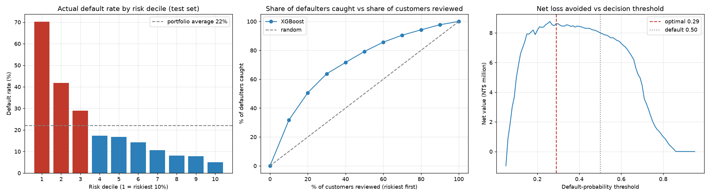
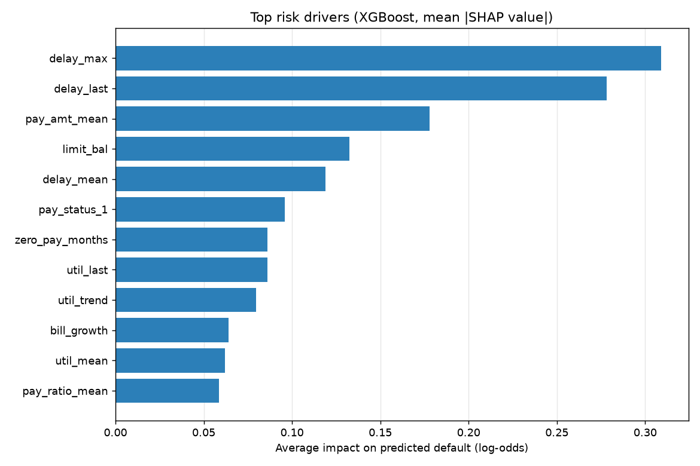

# 💳 Credit Card Default Risk Model

> **Real data (30,000 card holders) · XGBoost vs logistic regression · AUC 0.780 · Gini 0.561 · KS 0.437 · SHAP reason codes · loss-minimising cut-off**

Predicts which credit-card customers will default on next month's payment, using six months of their statement history. It then turns the scores into a decision: who to act on, and why each customer was flagged.

Dataset: [UCI Default of Credit Card Clients](https://archive.ics.uci.edu/dataset/350/default+of+credit+card+clients) (Yeh & Lien, 2009). 30,000 real customers of a Taiwanese bank, April–September 2005, 22.1% default rate. CC BY 4.0.

---

## 🎯 Results (held-out test set, 6,000 customers)

| Model | AUC | Gini | KS | PR-AUC | 5-fold CV AUC |
|---|---|---|---|---|---|
| Logistic Regression (baseline) | 0.751 | 0.503 | 0.388 | 0.515 | 0.770 ± 0.004 |
| **XGBoost** | **0.780** | **0.561** | **0.437** | **0.567** | **0.788 ± 0.005** |

*Gini (= 2·AUC − 1) and KS are the standard ranking metrics in credit risk. The final model is chosen by 5-fold CV AUC on the training set.*

- **Ranking:** the riskiest 10% of customers default at **70%**, against 22% overall. Reviewing that 10% catches **32%** of all defaulters, and the riskiest 20% catches **51%**.
- **Decision threshold:** chosen on out-of-fold predictions for the training set, then reported on the test set. Acting on customers with P(default) ≥ **0.29** flags 1,409 customers and catches **750** defaulters. At the usual 0.50 cut-off it catches only 492. Net loss avoided is **NT$8.62M vs NT$8.00M***.
- **Explainability:** each customer gets their top 3 risk drivers from SHAP values, in plain English (e.g. *"Payment late last month; Serious past delinquency; Frequently late"*). These work like the adverse-action reason codes lenders are required to give.

\*Assumes early action saves 30% of a defaulter's balance, and wrongly restricting a good customer loses 10% of their balance in margin. With those costs the break-even probability is 0.25, close to the 0.29 the search found.




---

## ⚙️ How it works

1. **Cleaning.** `PAY_0` is renamed to `PAY_1` (a known naming error in the source). Undocumented `EDUCATION` codes (0/5/6) and `MARRIAGE` code 0 are folded into "other".
2. **Feature engineering.** The 6-month history becomes 16 engineered behavioural features, used alongside 4 profile columns and the 6 raw monthly repayment statuses (26 inputs in total):
   | Group | Examples |
   |---|---|
   | Delinquency | last / max / mean months late, months delayed, delinquency trend |
   | Utilisation | balance ÷ limit (last, mean, max, trend), months over limit |
   | Repayment | payment ÷ the bill it settles, months with zero payment, average payment |
   | Profile | credit limit, age, education, marital status |
3. **Models.** A logistic-regression baseline (plain, on scaled features, without the binning a bank scorecard would use) vs XGBoost. 5-fold stratified CV on the training set picks the winner.
4. **Threshold.** The cut-off is chosen by sweeping thresholds on out-of-fold training predictions and minimising expected loss, with costs that scale with each customer's balance. The test set is only used to report the result.
5. **Explainability.** XGBoost's built-in TreeSHAP (`pred_contribs`) gives global feature importance and per-customer reason codes.

## 🗂️ Structure

```
├── train_model.py                 # cleaning → features → models → threshold → SHAP → reports/
├── business_insights_report.py    # charts + credit-risk briefing from reports/
├── data/uci_credit_default.csv    # source data
└── reports/
    ├── metrics.json               # every score and business figure
    ├── credit_risk_report.md      # briefing for a credit-risk manager
    ├── scored_test_customers.csv  # probability, flag and reason codes per test customer
    ├── decile_table.csv, threshold_curve.csv, shap_importance.csv
    └── model_performance.png, shap_importance.png
```

## 🚀 Run

```bash
pip install -r requirements.txt
python train_model.py
python business_insights_report.py
```
Runs on a laptop CPU in under a minute.

## ⚠️ Limitations

- One bank, one country, 2005. The feature pipeline transfers to other markets; the fitted model does not.
- Cost figures are placeholders; plug in a lender's real loss-given-default and margin numbers.
- Age, education and marital status are predictive but restricted in many lending regimes; a production model would need a fair-lending review, and possibly retraining without them.
